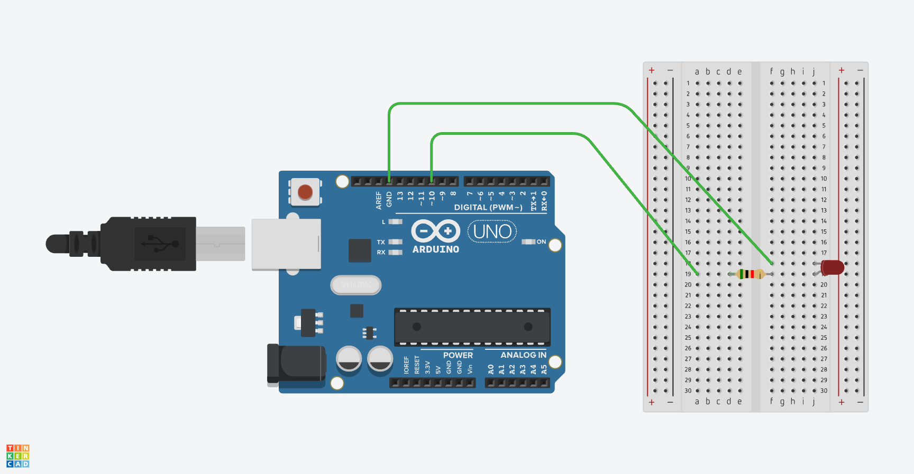

# Blink a morse code!

An Arduino project for a simple morse code blinker.

Original project was built on an Arduino Uno.

Since I'm clueless about the world of morse code I went and found some other source that looked and felt fairly authoritative: [MorseCode.World](https://morsecode.world)

They have a bunch of [information](https://morsecode.world/international/timing.html) about timings and how you break down dits and dahs and and intra- and inter- word spacing. It's more complicated than I'd've thought. The original idea was to bang out this super simple project in a couple hours but then it all spiralled into something much more complicated.

So while the circuit is as basic as you can get the code is a little more involved. I'm not super familiar with C++ and as such my code kinda looks like a dog's attempt at a ransom letter. At the very least I wrote some basic assumptive tests to validate the morse code timings; there's also a verbose debug mode that prints to the serial monitor what's happening and when to help debugging anything that might be squirrely.

## Schematic

## Setup

Grab the code, throw it into whatever you use and upload it to your board. If you look through the code you'll see that there are some defaults like setting you LED pin to 10 and the serial baud to 115200. Feel free to change those if they don't fit with your preferred defaults.

Once things are uploaded and you're monitoring the appropriate port and at the set baud rate you should see a prompt asking you what you're looking to turn into morse code. Just type a thing into the serial input and send it. You should see your LED happily blinking away.

If you want to see how everything's being translated set `debugMode` to `true`, re-upload, and you'll have the read out of all the dits and dahs and spacing printed out in the serial monitor.

If you want to run the tests set `testMode` to true and re-upload.

## How do I start morse'ing?

https://github.com/romanchukenator/morse-code-blinker/assets/6802842/6b9921d8-0e8c-4cfa-836e-6037b98d67da

Short answer is via the serial monitor.

Once you've uploaded the code to your board you'll need to set up the serial monitor's port and baud. So, for example I'd set my port to be `/dev/tty.usbserial-130 - `. The baud rate is `115200`. After see the serial monitor print out a friendly `Hi! What're we blinking?` you can type a message and send it as text and, so long as your circuit is setup correctly, you should be enjoying the teeny tiny flashes of communication.

If you want to do away with the serial output for each letter/phrase you can set `debugMode` to `false`.

## This ain't that great

Yep. I know.

I know I'm an asshole programmer spoiled by web development's boundless system resources, the wild west of dynamic typing, a laissez-faire attitude to performance and the shocked and indignant reaction to the question of maintainability.

If anyone's willing to make some comments or PRs on how to improve this lacklustre code, please do. I mean, lets be civil and nice about the whole ordeal, but I'm definitely open to improving this pile of monkeyed code.

## I wanna make some changes, cool with that?

Yeah, go for it. Play around and do what you want.

I'd suggest running the basic tests I've included. Just change `testMode` to `true` and so long as all the tests pass I'd say you're good to go.
